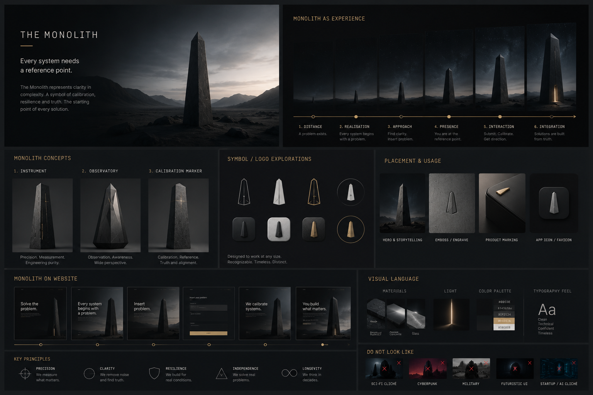
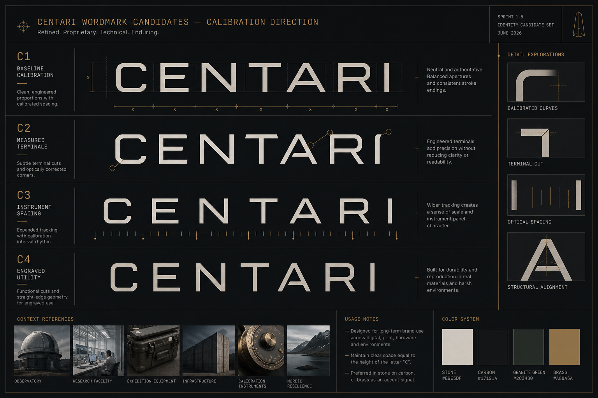
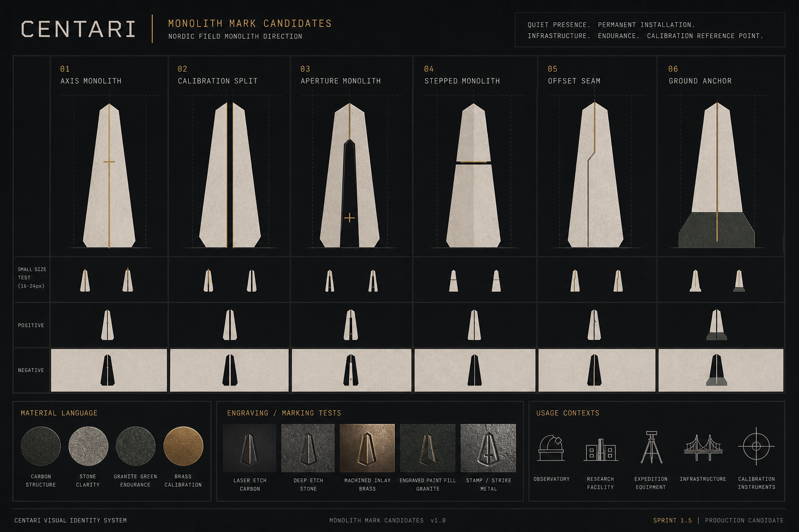
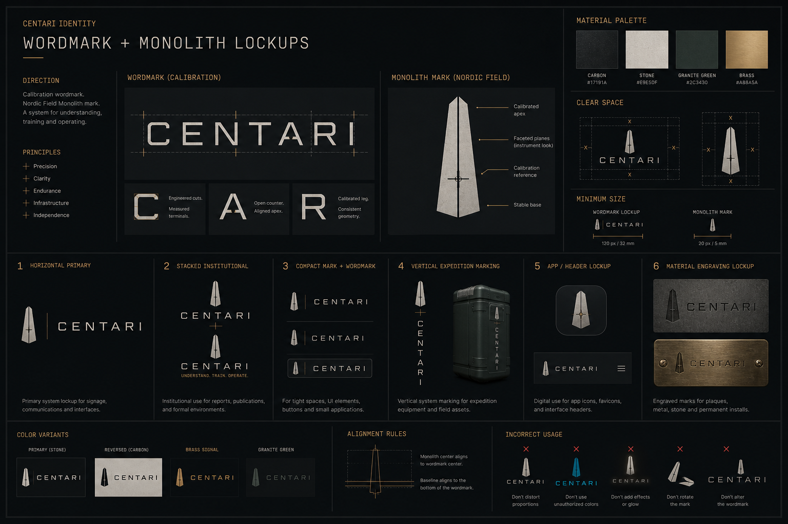
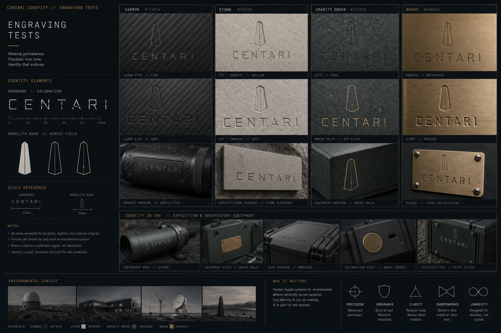
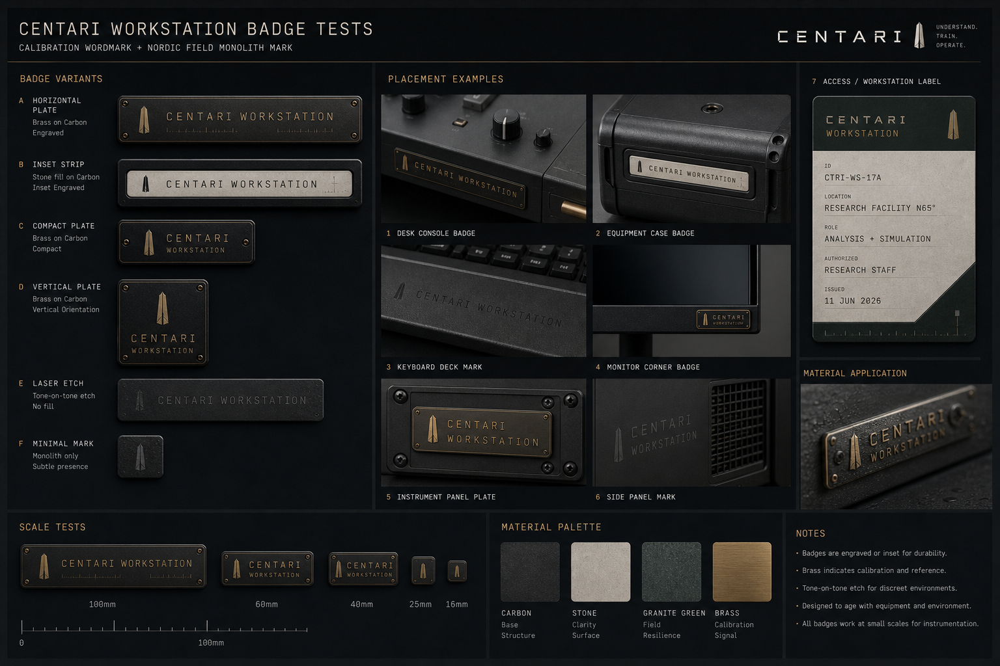
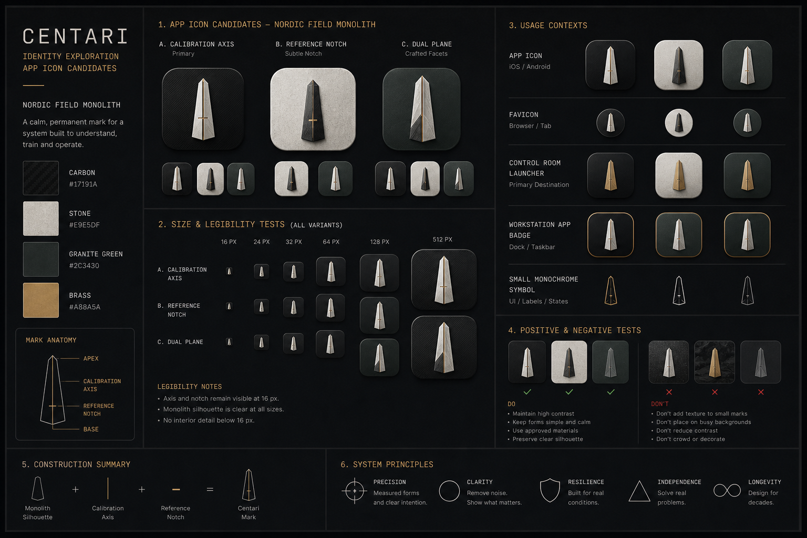

# Sprint 1.5 — Centari Identity Candidate

**Status:** First production-ready identity candidate for review  
**Scope:** Visual identity only. No website implementation, no app functionality, no code changes.

---

## Primary Reference

This convergence pass uses the attached monolith exploration board as the primary reference.

The direction is no longer broad exploration. The identity is converging around:

- Calibration wordmark
- Nordic Field Monolith
- carbon, stone, granite green, brass
- observatory / research facility / expedition equipment / infrastructure / calibration instruments
- quiet endurance rather than mystery

Avoided categories:

- cyberpunk
- startup aesthetics
- AI cliches
- military styling
- space opera
- generic technology branding

---

## 1. Final Wordmark Candidate Set

### Approved Candidate: C2 / Measured Terminals

C2 is the approved production candidate. The measured terminal cuts add proprietary character while preserving technical precision, legibility, and restraint. It should be refined carefully rather than redesigned.

### Secondary Candidate: C4 / Engraved Utility

C4 is useful for material applications and harsher physical contexts. It should be tested as a secondary engraving variant, not the primary digital wordmark.

### Notes

- Keep the wordmark uppercase.
- Preserve measured spacing and technical precision.
- Refine letterforms subtly, especially `C`, `A`, `R`, and `I`.
- Avoid adding futuristic cuts simply for distinctiveness.
- Final production work should vectorise the chosen candidate manually.

---

## 2. Final Monolith Mark Candidate Set

### Approved Candidate: 02 / Calibration Split

Calibration Split is the approved production candidate. It carries the reference-point logic of the monolith while feeling more specific to calibration, infrastructure, and permanent installation than a simple central axis.

### Secondary Candidate: 06 / Ground Anchor

Ground Anchor is strongest for infrastructure and permanence. It may be useful where the identity needs more physical weight, especially signage, hardware, and environmental applications.

### Notes

- The mark should feel installed, not launched.
- The split calibration line is a useful brand device.
- The base should imply stability without becoming a pedestal.
- Avoid glowing apertures, mysterious cores, or alien-monolith associations.

---

## 3. Wordmark + Monolith Lockups

### Recommended Primary Lockup

Horizontal mark + wordmark is the strongest system lockup for website header, documentation, product surfaces, and presentation materials.

### Recommended Secondary Lockups

- Stacked institutional lockup for reports and formal documents.
- Compact mark + wordmark for tight UI spaces.
- Vertical expedition marking for equipment and field cases.
- Material engraving lockup for permanent installations.

### Notes

- The monolith should align optically to the wordmark baseline and cap height, not mechanically.
- Clear space should be generous.
- Brass should remain an accent signal, not the default wordmark color.

---

## 4. Engraving Tests

### Strongest Applications

- laser etch on carbon
- shallow cut in stone
- brass inlay on granite green
- stamped brass plate
- tone-on-tone product marking

### Notes

- Engraving is central to the identity. The mark should look credible when cut into material.
- Subtle physical imperfection is acceptable; decorative distress is not.
- The identity should feel durable enough for expedition equipment and research infrastructure.
- Avoid shield-like support symbols in final identity work.

---

## 5. Workstation Badge Tests

### Recommended Direction

The workstation identity should feel like a permanent equipment label: engraved, inset, useful, and quiet.

Best candidates:

- horizontal brass-on-carbon plate
- inset stone strip on carbon
- tone-on-tone laser etch
- compact monolith-only plate for small hardware

### Notes

- `CENTARI WORKSTATION` works best when treated as equipment marking, not a marketing label.
- Brass can indicate calibration and reference, but should not become decorative trim.
- Badge screws and plates are acceptable when they feel industrial, not tactical.

---

## 6. App Icon Tests

### Recommended Direction

Use the monolith mark as the app icon core, but simplify further than the rendered tests. The strongest direction is a flat, graphic monolith silhouette with minimal axis detail.

### Notes

- The icon must remain legible at small sizes.
- Avoid material texture, render depth, and surface lighting below app-icon scale.
- Use flat positive/negative versions for system contexts.
- The Control Room launcher can use a brass signal detail, but the core mark should remain flat and restrained.

---

## Candidate System Summary

Recommended first production identity candidate:

| Element | Direction |
|---------|-----------|
| Wordmark | C2 Measured Terminals |
| Secondary wordmark | C4 Engraved Utility |
| Monolith mark | 02 Calibration Split |
| Secondary mark | 06 Ground Anchor |
| Primary lockup | Horizontal mark + wordmark |
| Material behavior | Etched, engraved, inset, tone-on-tone |
| Workstation badge | Horizontal equipment plate |
| App icon | Flat monolith silhouette with minimal axis detail |

---

## Production Readiness Notes

These boards establish the first production-ready candidate direction, but the generated visuals are not final vector artwork.

Before production use:

1. Redraw the selected wordmark in vector form.
2. Redraw the selected monolith mark as a clean vector system.
3. Test the mark at favicon, app icon, header, engraving, and signage sizes.
4. Define exact clear-space and minimum-size rules.
5. Produce positive, negative, one-color, and material variants.
6. Validate that no final symbol reads as military, tactical, or sci-fi.

---

## AD Review Questions

1. How far should C2 be refined before it risks becoming a redesign?
2. Should C4 become a material-only alternate?
3. How minimal should the Calibration Split detail become at small sizes?
4. Should Ground Anchor be retained as an infrastructure variant?
5. Is the split calibration line acceptable as a recurring identity device?
6. Should Workstation use the full wordmark or monolith-only badge at small sizes?
7. Should the app icon be entirely flat, or may it keep a subtle material reference at larger sizes?
